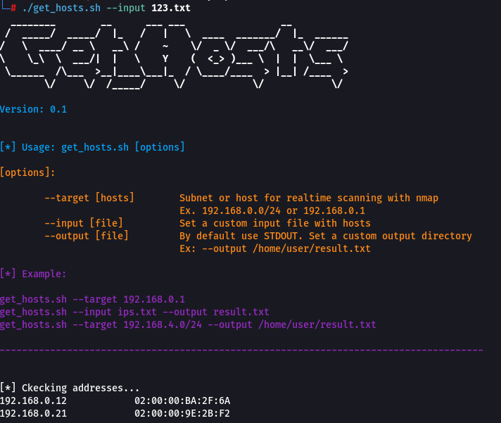

# get_hosts.sh

## Description

The bash script used for scan and parse IP-addresses, ports and MAC-addresses for easy paste to excel.

## Usage



## Result

```sh
./get_hosts.sh --target 192.168.0.2
```


```sh
./get_hosts.sh --target 192.168.0.2 --output result.txt
```


