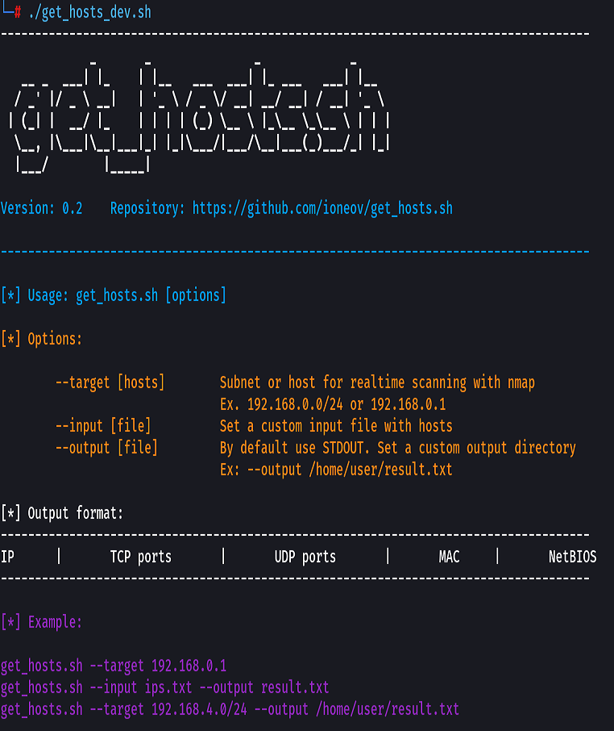

# get_hosts.sh

## Description

The bash script used for scan and parse IP-addresses, ports and MAC-addresses for easy paste to excel.

Parsing Include:

- IP-address
- open TCP ports
- opne UDP ports	
- MAC-address
- NetBIOS-name

## Usage

Supported Switches:

--target [hosts]	Subnet or host for realtime scanning with nmap. Example: 192.168.0.0/24 or 192.168.0.1

--input [file]		Set a custom input file with hosts

--output [file]		By default use STDOUT. Set a custom output directory. Example: /home/user/result.txt




## Result

```sh
./get_hosts.sh --target 192.168.0.2
```


